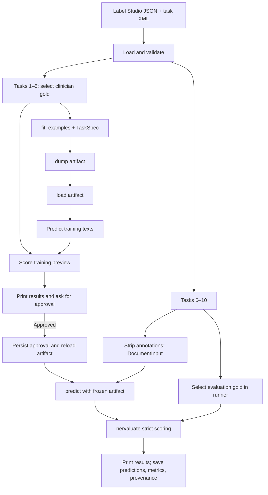

generalized structure of text, for medical corporas mostly

the system will evolve into an user facing platform, which they can define the structure, give some examples
and "teach" the extractor to work on those samples with a structure defined

it is a priority that it should run on local, an idea is that the extractors defined perharps the initial fitting, there might be some that work on the cloud, assuming the sent initial samples do not contain any 
personal data, but then the result can be ran locally (for instance, a capable coding model iterates on generating code for spacy rules, which then can be easilly run locally, or iterating on the prompt of a smaller llm, with a bigger llm teacher (see methods/ agentic spacy and llm for some definitions of this))

thats why its needed that the core should be somwhat extensible to something different that the cli

the v1 would be approximately:
- download a desktop app (or access a website TBD)
- create a project
- interface to define/upload desired extrucure
- iteration on the extractor, upload some examples that match the format input:text -> output:the defined schema
- by default a extractor is selected but user should be able to select the desired one
- the extractor starts "learning" from the exmamples as a parallel job
- user notified when job is finished, visualize results, and errors. extractor not yet finished until the user signs, in this process user can change samples/structure/prompts/ highhlight erorrs etc.
- user sign when is comfortable with the result. client receives the "trained" model.
- user can access the trained extractor, and pass more (labelled or unlabled) samples that will run locally in parallel.
- user can see a result of the run, export results etc


the v0.1 will look like:
- set some of the main interfaces that could be resued later. for now:
    - a way to load data, handle errors different structures etc
    - an evaluator that can handle the input ouput, computing the metrics, training splits etc.
    - interoperable base between extractors
    - main basic extractors evaluated
    - the demostration will be done with a cli calling the main components, on the reumalago anotated dataset
    - for now only a python cli, no downloadable, no distinctino between user facing application or whatever

things to consider for next:
- its depending on labelstudio schema for annotations, and for outputs, either define a version that its not dependnent of it, and do the translations modules for it or find another standard. BigIO hugginface maybe
- code is already ugly, use some strict coding style
- the naming convention is not obviouly related with extractor, think if i will change it to extractor or leave it like this. problem is method is too general
- cli has too many logic, should consider creating a runner and or factory for defining the pipeline expelicitly and not letting the frontend being the one assembling it
- relation evaluation not implemented yet
- cli has too many logic, should consider creating a runner and or factory and or orchestration  for defining the pipeline expelicitly and not letting the frontend being the one assembling it
- relation evaluation not implemented yet
- agent not implemented yet
- clone on mac studio, send data, install, ml server active, try model for extraction and agent

## Running the first harness

Start with the [installation guide](docs/install.md), then use the
[CLI guide](docs/cli.md) for stages, sample offsets, every flag, approval,
saved files and troubleshooting.
For an Apple Silicon Mac, the
[MLX quick start](docs/install.md#quick-start-on-an-apple-silicon-mac-with-mlx-lm)
covers cloning, one-command dependency setup, copying your private files and
running your choice of local model:

```bash
uv sync --locked --extra mlx
uv run --extra mlx mlx_lm.server \
  --model "$HOME/Models/Qwen3.8-27B-bf16" --host 127.0.0.1 --port 8080
```

When fitting the LLM prompt, select `--llm-backend mlx`, pass
`--endpoint http://127.0.0.1:8080/v1`, and use that same model ID or local path
with `--model`. Fitting saves a few-shot prompt and leaves the model weights unchanged.
The [method guides](docs/methods/README.md) explain the shared contract and how
[BERT](docs/methods/bert.md), [LLM](docs/methods/llm.md) and
[dummy](docs/methods/dummy.md) work, including the rationale of the current code.
The [Spanish Manim lesson](docs/animation.md) animates BIO conversion, the
transformer encoder/classifier, training and the paper's heldout folds.

The working version is a local Python CLI. It reads Label Studio exports, fits an
extractor on a selected slice, saves and reloads its artifact, shows a training
preview for approval, then predicts a separate slice and scores it with nervaluate.
The existing top-level layout is retained.

Install Python and libraries through `uv`:

```bash
uv sync --extra bert
uv run --extra bert python cli.py --help
```

`-h` and `--help` both display usage. If errors are visible but help and results
are blank, stdout may have been redirected by the shell.
`uv run python cli.py --help 1>&2` sends help to stderr as a diagnostic; in an
interactive terminal, `exec 1>/dev/tty` restores stdout to that terminal.

`.python-version` selects Python 3.12; `uv.lock` pins the resolved dependencies.
PyTorch uses its CPU wheel index on Linux/Windows and PyPI on macOS.
The first BERT fit downloads the multilingual
DistilBERT checkpoint; subsequent predictions load the saved weights locally.
For dummy/LLM use without PyTorch, `uv sync` is sufficient. LM Studio runs separately.
`data/`, `schemas/`, `.venv/`, model caches and `runs/` are ignored by Git.
The private Label Studio XML is supplied locally at `schemas/reumalago.xml`, or
through `--task-spec data/label_studio_config.xml`; see the
[schema setup instructions](docs/install.md#4-add-the-label-studio-exports).

Inspect both exports before choosing a gold policy:

```bash
uv run python cli.py --stage inspect \
  --data data/grupo1.json --data data/grupo2.json \
  --output runs/inspection
```

Inspection prints annotation counts, authors, parent links, ground-truth flags,
selection reasons, entity/relation totals and validation issues. It saves
`inspection.json` when `--output` is supplied. Raw exports are never rewritten.

Fit on the first five tasks, then predict the next five in a new process:

```bash
uv run --extra bert python cli.py --stage fit --method bert \
  --data data/grupo1.json --offset 0 --count 5 \
  --dump runs/bert/artifact

uv run --extra bert python cli.py --stage predict \
  --data data/grupo1.json --offset 5 --count 5 \
  --load runs/bert/artifact --output runs/bert/evaluation
```

The fit command prints a preview and strict training scores before asking
`Approve this fitted artifact for prediction?`. Answering no leaves the saved
artifact unapproved. A later predict command shows that preview again and asks
for approval. An inference failure prevents approval even with `--yes`.
The preview is **resubstitution on training examples**, so its score measures
fit behavior and is not a held-out performance estimate.

For the complete first-five/next-five flow in one command:

```bash
uv run --extra bert python cli.py --stage run --method bert \
  --data data/grupo1.json --count 5 --predict-count 5 \
  --dump runs/bert_run/artifact --output runs/bert_run/evaluation
```

With Gemma loaded and LM Studio's server running:

```bash
uv run python cli.py --stage run --method llm \
  --data data/grupo1.json --count 5 --predict-count 5 \
  --endpoint http://localhost:1234/v1 --model google/gemma-4-e2b \
  --dump runs/gemma/artifact --output runs/gemma/evaluation
```

`--method dummy` exercises the same lifecycle without weights or a server.
It always predicts an empty result. Add `--yes` to explicitly approve a scripted
run without the interactive question. Choose a new artifact directory for each
fit; fitting refuses to overwrite a nonempty directory.

| Flag | Meaning |
| --- | --- |
| `--data PATH` | Required Label Studio export; repeat to concatenate files in the given order. Task IDs must be unique. |
| `--stage inspect\|fit\|predict\|run` | Defaults to `run`. |
| `--method dummy\|bert\|llm` | Required when fitting; inferred from an artifact when predicting. |
| `--count N` | Fit size or standalone prediction size; default 5. |
| `--offset N` | Zero-based start; default 0 for fitting and 5 for standalone prediction. |
| `--predict-count N` | Evaluation size after fitting in `run`; default 5. |
| `--dump PATH`, `--load PATH` | Artifact destination for fitting and source for prediction. |
| `--output PATH` | Evaluation directory; defaults to the artifact's sibling `evaluation/`. |
| `--task-spec PATH` | Label Studio XML; defaults to `schemas/reumalago.xml`. |
| `--instructions PATH` | Optional text/Markdown instructions included in the fitted task definition. |
| `--gold-policy clinician\|latest\|ground-truth` | Explicit annotation selection; default `clinician`. |
| `--reviewer-id N` | Repeat for clinician IDs; defaults to 3 and 4. |
| `--epochs N`, `--checkpoint NAME`, `--seed N` | BERT settings; defaults to 3 epochs, multilingual DistilBERT, seed 42. |
| `--freeze-encoder`, `--full-finetune` | Default trains the classifier head; full fine-tuning also updates encoder weights. |
| `--endpoint URL`, `--model NAME` | Local server address and model ID/path saved in the artifact. |
| `--llm-backend lmstudio\|mlx` | Default `lmstudio` uses native JSON schema; `mlx` puts the schema in the prompt. Saved in the artifact. |
| `--thinking`, `--no-thinking` | LM Studio: preserve the server setting or request thinking off. MLX: request thinking on/off through the chat template. |
| `--yes` | Explicit approval for scripted runs. |

Selection is sequential and reproducible in file order. In `run`, evaluation
starts immediately after the fit slice. The seed controls BERT training, not
sample selection. No meaning is inferred from the names grupo1/grupo2.
Prediction rejects any document whose text was used during fitting, even if its
task ID changed. A loaded artifact restores its saved schema and method settings;
fit-time model flags do not modify that artifact.

Unlabeled Label Studio tasks need only `id` and `data.text`. To predict five new
tasks from a separate file, use `--stage predict --offset 0 --count 5 --load ...`.
An unlabeled slice writes `metrics.json` containing `null`. A slice must be either
fully labeled or fully unlabeled.

## The method contract

For a walkthrough of each algorithm and its saved state, see the
[method guides](docs/methods/README.md).

`methods/base.py` defines one generic abstract class, `Method[ArtifactT]`:

```python
artifact = method.fit(train_examples, task_spec, dev_examples=None, scorer=None)
method.dump(artifact, directory)
artifact = method.load(directory)
predictions = method.predict(artifact, inputs)
metrics = score(predictions, gold_examples)
```

| Type | Contents / purpose |
| --- | --- |
| `DocumentInput` | Required document ID and text; prediction cannot see annotations. |
| `TrainingExample` | Document input plus the explicitly selected gold annotation. |
| `TaskSpec` | Entity/relation vocabulary, Label Studio control names, optional instructions. |
| `EntityResult`, `RelationResult` | Typed Label Studio result dictionaries, including optional export fields. |
| `LabelStudioTaskPrediction` | Task ID, text and a Label Studio `predictions` list. |
| `MetricsReport`, `PRFScore` | Strict global/per-label entity scores, support and failed-document count. |
| `BertConfig`, `LLMConfig` | Method-specific settings; the common interface does not union every possible option. |
| `BertArtifact`, `LLMArtifact`, `DummyArtifact` | Each method's concrete reusable fitted state. |

The common mandatory fit inputs are examples and a task definition. Optional
development examples and a typed scorer are keyword arguments. A method can
require them for a future optimization algorithm and validate that requirement
in its own `fit`. BERT and this few-shot LLM implementation do not need them.
Other method-specific requirements belong in the method's typed configuration.

There is no shared optimizer contract. BERT's Trainer calls its model's supervised
loss and updates weights with AdamW. The LLM method saves a fixed prompt and
demonstrations; it does not train Gemma weights. A future prompt/rule optimizer
can use the supplied scorer on allowed train/development examples inside `fit`.
The runner owns held-out gold and only scores after the artifact is frozen.



## Method behavior and current limits

BERT uses `distilbert/distilbert-base-multilingual-cased` with a BIO classifier.
It runs on CPU with four threads, 256-token windows and a 64-token stride.
By default the encoder is frozen and only the new classifier head trains at
learning rate `5e-4`; the CLI's full fine-tuning option uses `5e-5`. BIO is an
internal adapter. It cannot retain overlapping/multiple labels at one token;
the longest-first projection records each loss in `fit_notes`. Token boundary
projections are reported too. Full original gold is retained for evaluation.
BERT currently predicts entities only.

Gemma uses Pydantic AI's native JSON-schema output. It returns exact entity quotes
and a zero-based occurrence index; Python resolves these to character offsets.
It parses a typed JSON response and allows one JSON/schema repair retry.
Entity/relation response models are temporary inference adapters; exported
predictions always use Label Studio results. Missing relation labels in training
gold are retained by the loader but omitted from LLM demonstrations, rather than
guessing their type. The fitted prompt contains all selected demonstrations.

The grounding adapter keeps literal quotes. Absent quotes and invalid occurrence
indices for repeated quotes are omitted, together with relations whose endpoints
are missing or were omitted. Unknown labels and duplicate entity IDs are omitted
with warnings too. If a quote appears exactly once, an incorrect occurrence index is
unambiguously corrected to zero. All omissions/corrections are printed before
approval and saved in `meta.extraction_warnings`; valid mentions remain available.
It does not expand abbreviations, normalize quotes or consult evaluation gold.
These are extraction-quality warnings. Network or unrepaired JSON/schema
failures remain document errors and block approval.

Thinking is disabled using `reasoning_effort="none"`, supported by LM Studio's
[OpenAI-compatible API since 0.4.8](https://lmstudio.ai/changelog/lmstudio/lmstudio-v0.4.8).
`--thinking` leaves the server's reasoning configuration active. API calls have a
finite timeout, no automatic HTTP retries, and progress logs per document. Failed
documents remain in the exported predictions with `meta.extraction_error` and
empty results. They remain in the evaluation denominator and cause a nonzero
CLI exit. A failed training preview leaves the artifact unapproved.

The primary metric is nervaluate strict entity micro precision/recall/F1: an
entity is correct when start, end and label all match. Per-label strict scores
are printed and saved. Label Studio end offsets are exclusive; the evaluator
adapts them to nervaluate's inclusive offsets. Exact predictions are passed to
the library before overlapping errors, with duplicate counts respected, so its
greedy overlap matching cannot consume a later exact match. Metric computation
itself stays in nervaluate. Entity IDs do not need to match gold IDs.

Relations are loaded, retained and predicted by the LLM, but relation scores are
explicitly `null`. Reports also include full-credit, same-label character
overlap and strict/overlap macro averages over labels with gold support. See the
[evaluation guide](docs/evaluation.md) for the matching and macro policies and
paper comparison limits. Improving BERT quality, adding relation scoring,
adding a development split, and trying prompt optimization or agent-generated spaCy rules are subsequent experiments.
`methods/agentic_spacy.py` retains the original design notes.

## Gold selection and dataset findings

The supplied exports each contain 400 tasks. All 800 original annotations are
marked `ground_truth`, while 797 tasks also have a separate clinician annotation
created by reviewer 3 or 4. Most revisions have a parent link, but 17 do not.
Therefore the default `clinician` policy prefers clinician-created annotations.
If none exists, it falls back to an original updated by a clinician and warns.
No candidate or a timestamp tie is an error; cancelled annotations are excluded.

Three singleton tasks (182, 376 and 605) use that warned in-place-update fallback.
Ten tasks have an original updated later than the separate review; the policy
still selects the clinician-created revision and flags the provenance ambiguity.
The exports alone cannot prove which edit was final in those cases. `latest`
selects the latest update regardless of author; `ground-truth` selects among
explicitly flagged annotations. Always inspect before changing that choice.

With the default policy, grupo1 has 6,929 entities and 2,170 relations; grupo2 has
8,143 entities and 2,870 relations. Both cover all 42 XML entity labels. Inspection
reports 17 and 27 issues respectively. These include six quote/offset mismatches,
three duplicate spans, 21 unlabeled relations, and one invalid zero-length entity
in grupo1 task 400. Warnings retain offsets and gold content; selected examples
with structural errors are rejected. The first ten grupo1 tasks pass validation.

## Saved files and checks

```text
runs/example/
├── artifact/
│   ├── method.json                 # task definition and method configuration
│   ├── fit.json                    # selected IDs, hashes, policy, versions, approval
│   ├── training_predictions.json   # Label Studio training preview
│   ├── training_metrics.json
│   ├── model/                      # BERT weights/config/tokenizer, when applicable
│   ├── prompt.txt                  # LLM recipe, when applicable
│   └── examples.json               # LLM demonstrations, when applicable
└── evaluation/
    ├── predictions.json            # Label Studio task predictions, no gold
    ├── metrics.json
    ├── config.json                 # run IDs, sources, policy, versions, artifact path
    └── run_summary.txt
```

The default schema is stored with every method artifact. Source hashes, selected
annotation IDs, train-text hashes, timestamps and library versions make the run
auditable. BERT includes its seed in its saved config. LLM artifacts require the
configured Gemma model to remain available in LM Studio when reloaded.

```bash
uv run --extra bert pytest -q
uv run ruff check .
uv run ruff format --check data.py evaluator.py cli.py methods/base.py methods/dummy.py methods/bert.py methods/llm.py tests
uv run --extra bert mypy data.py evaluator.py cli.py methods
```

Tests use synthetic annotations, fake LLM inference and a tiny locally constructed
BERT checkpoint. They need neither an API key nor a remote model download.
Implementation stages and validation are recorded in [DEVELOPMENT.md](DEVELOPMENT.md).

## Development memoir — 6 October 2026

I kept the repository's original modules and product notes, then built the small
evaluation shell around them. `uv` installed Python 3.12.14 and the locked
libraries, including nervaluate 1.2.1, Pydantic AI slim 2.54.0, Transformers 5.18.0
and PyTorch 2.14.1 CPU. The supplied XML became the task vocabulary, and the real
Label Studio files stayed local and unchanged.

The first important finding was annotation provenance: the original automated
annotations carry the ground-truth flag, while the separate clinician revisions
usually do not. I implemented the explicit reviewer-based policy, reported the
in-place revisions and later-original ambiguities, and inspected all 800 tasks.
That inspection also surfaced the invalid span, quote/offset discrepancies,
duplicate spans and unlabeled relations documented above.

The shared API now covers typed training examples, task specifications, method
configuration, concrete artifacts, text-only prediction inputs and score reports.
Each method owns its learning procedure. The runner selects slices, stores
provenance, previews the persisted artifact, records approval, and keeps held-out
gold outside prediction. Dummy, multilingual DistilBERT and local Gemma all use
the same lifecycle. A small adapter fixes nervaluate's greedy ordering edge case
without replacing its metric implementation.

The main live-inference hiccup was Gemma's output. I disabled API reasoning and
bounded retries while diagnosing responses; it still sometimes expanded
abbreviations, miscounted occurrences or created invalid relation references.
The final grounding adapter
emits literal spans, abstains on unsupported mentions, corrects only unambiguous
unique-quote indices, and shows every change before approval. It saved 31 warnings
on the training preview and 35 on the held-out slice. Actual API/schema failures
still produce saved errors and prevent approval; extraction warnings remain
visible for judging model quality.

The real smoke test fits grupo1 IDs **1–5** (165 gold entities), saves/reloads the
artifact, and predicts IDs **6–10** (51 gold entities). Results:

| Method | Training preview F1 | Held-out precision | Held-out recall | Held-out F1 | Document errors |
| --- | ---: | ---: | ---: | ---: | ---: |
| Dummy | 0.0000 | 0.0000 | 0.0000 | 0.0000 | 0 |
| DistilBERT, frozen encoder, 3 epochs | 0.0000 | 0.0000 | 0.0000 | 0.0000 | 0 |
| Gemma 4 E2B, five demonstrations | 0.7751 | 0.2326 | 0.1961 | 0.2128 | 0 |

These scores verify the pipeline and expose weak extraction quality. The five
held-out records are a smoke test, not a paper reproduction. No held-out labels
were used to adjust the methods. BERT's predictions were identical after a
separate-process reload. Gemma's final 5+5 command completed with exit code zero,
and a fresh-process Gemma reload reproduced the first held-out document exactly.
The real terminal approval question was exercised with the dummy method.
Predictions, scores and manifests are under `runs/dummy_first5/`,
`runs/bert_first5/` and `runs/gemma_first5_final/`; unsuccessful diagnosis runs are
also retained locally for inspection.

The current suite has **33 passing tests**, covering annotation selection, offsets,
strict scoring, nested/duplicate cases, artifact persistence, BERT windows,
LLM grounding, failure denominators and the approval flow. Ruff, formatting,
mypy and `uv pip check` pass. Tests require neither a remote model download nor
an API server. Relation metrics remain explicitly uncomputed; BERT and Gemma
quality, development splits and paper-compatible relation/overlap evaluation
are the next experiments.

Work was committed and pushed progressively, with details in each commit body
and `DEVELOPMENT.md`:

| Push | Change |
| --- | --- |
| `a254216` | uv setup, typed Label Studio data, gold selection, evaluator, base API and dummy method. |
| `f5c033d` | BERT/Gemma artifacts, CLI stages, review/approval and lifecycle tests. |
| `432c693` | Strict-matching edge-case fix, approval regression and usage/architecture documentation. |
| `092f235` | Grounded LLM output, visible diagnostics, typed manifests and warning/abstention tests. |
| Final documentation push | Recorded the completed real runs, measured limitations and this memoir. |
| CLI help follow-up | Added `-h`, tested both help flags, and documented shell stdout diagnosis. |
| `b710eeb` | Added separate installation and CLI guides, offset examples and hidden approval-prompt troubleshooting. |
| Method documentation follow-up | Added shared contract and BERT/LLM/dummy guides covering background, implementation choices and saved state. |
| `ee16ec4` | Added MLX prompted JSON output, saved backend selection, Apple Silicon dependencies and HTTP/CLI regression coverage. |
| Mac installation follow-up | Added the clone-to-run guide using the existing local model, private file placement and reproducible setup checks. |

The first follow-up concerned apparently silent help and run commands. Both
rendered correctly in subprocess and PTY checks. A nested interactive bash had
stdout connected to a pipe while stderr remained on the terminal, matching the
reported visibility difference. The existing Gemma artifact had a successful,
unapproved training preview; repeating `run` also produced the expected nonempty
artifact error. I added the missing `-h` alias and two help regressions; all 33
tests, Ruff and mypy pass.

The next follow-up added `docs/cli.md` as the dedicated command reference. It
explains zero-based offsets, stage-specific defaults, the combined `run` slices,
all flags, approval, saved files and troubleshooting, with runnable examples.
`docs/install.md` separately covers cloning, uv/Python dependencies, local exports,
LM Studio and setup checks. Both guides are linked from the README.
The documented dummy 5+5 lifecycle was verified against the real export in a
temporary directory. The CLI guide also explains that the prediction-start line
comes after approval, including the hidden-prompt symptom caused by redirected
shell stdout.

The next documentation pass added a shared method overview and separate BERT,
LLM and dummy guides under `docs/methods/`. They explain the learning signal,
representation adapters, artifact lifecycle and code choices: token-label loss
and flat BIO projection for BERT, demonstration prompting and literal-quote
grounding for LLM, and successful empty predictions for dummy. The guides trace
the current implementation, link to its tests and primary background sources,
and distinguish algorithm settings from the options exposed by the CLI.

The private Label Studio XML had been included in the first implementation
commit. The privacy correction keeps that file local, ignores `schemas/`, and
removes private schema/data directories from the published branch history. CLI
tests now generate a small synthetic schema rather than depending on the private
XML. Installation documentation explains how to supply a local schema after
cloning. Commit identifiers recorded above refer to the development history
before this cleanup.
The cleaned branch was verified without the schema, and all 33 tests passed in
a checkout with no private XML. GitHub still served the old raw-file copy by its
previous commit hash after the rewrite; a local Support-request draft contains
the details needed for GitHub to clear those cached objects.

The Mac follow-up added `uv sync --locked --extra mlx` and a two-terminal guide
for an existing local MLX LM model. The model path is configurable; the examples
use `~/Models/Qwen3.8-27B-bf16` and port 8080. LLM fitting still builds and saves
demonstrations without updating model weights. The selected server backend is
saved with the endpoint and model so prediction restores the same recipe.

MLX LM ignores OpenAI's native JSON schema option, so its adapter includes the
schema in the prompt and validates the returned JSON through Pydantic AI.
LM Studio retains its native schema path. The thinking control also follows each
server's API. The Mac dependencies are optional, and macOS PyTorch uses PyPI.

A fresh checkout without private files passed dependency installation, help,
dependency checks, 38 tests with the BERT module skipped, and a synthetic dummy
fit/reload/predict. With the BERT extra, all **40 tests pass**. New mocked HTTP
tests cover both backends, JSON repair, saved settings and the complete LLM CLI
lifecycle. Apple Silicon wheel selection passes a macOS target dry run. Actual
Metal generation remains to be verified on the Mac with its existing model.
The changes were pushed in separate implementation and documentation increments;
private inputs, schemas and artifacts remain local.

The next evaluation increment reuses saved BERT weights without further
training. Explicit loading/progress messages and inference timings make runs
visible. Entity reports now include strict and full-credit label-aware overlap
micro scores, per-label scores and macro averages over gold-supported labels.
Scoring still uses nervaluate, with a small adapter for any positive overlap
and same-label matching. Tests cover matching edge cases, macro policy and
retained inference failures. The [evaluation guide](docs/evaluation.md)
documents the shared holdout, saved results, comparison limits and `tmux`.
Private split manifests and clinical results remain in ignored directories.

The real Mac inference run completed on the frozen heldout notes with no
failures or additional training. Saved artifact checksums were identical before
and after, and independent span/label multiset counts reproduced the strict
scores. Both Linux and Mac passed all 46 tests. The code was pushed here and
transferred as a verified Git bundle, keeping the Mac checkout on the same
committed revision without GitHub credentials. Scores, predictions, split
details and run provenance are saved privately under `data/` and `runs/`.

A small local replay checked the poor BERT predictions in detail. Encoder
weights, tokenizer, label mapping and predictions survive save/reload correctly;
feeding correct tags through the decoder reconstructs entities with the known
BIO projection limits. The saved task classifier remains weak. The method guide
now explains that fitting updates a new supervised classifier while freezing
the encoder by default, and that BERT/BETO do not receive the LLM's few-shot
instruction prompt. The local diagnosis performed no new training.

The next increment added a standalone Spanish Manim animation with synthetic
examples. Words become subwords and BIO targets, embeddings pass through
attention and encoder layers, and particles show the classifier's forward and
backward flow. All 750 note points move through five independent 600/150 splits
and merge into out-of-fold predictions. Changing entity boundaries explains
strict versus overlap, and the LLM sequence distinguishes zero-shot instructions
from few-shot demonstrations. The lesson clarifies that our adapter already
converts Label Studio spans to BIO and that the paper's BETO F1 uses test
predictions, while keeping our small frozen-encoder fit separate from its
fine-tuning protocol.

Manim is pinned in the script's own uv metadata; rendering needs neither the
private schema/data nor model downloads or LaTeX. The animation guide documents
native prerequisites, quality, frame rate and timing controls. Complete preview
renders and the full 1080p/30 fps MP4 were checked, with chapter timestamps and
an embedded reading guide exported alongside it. Native libraries and Python
dependencies were prepared in an isolated temporary environment. No model
weights were changed. Code and documentation were pushed in separate increments;
videos and intermediate files remain in ignored local runs.

A follow-up corrected the Linux animation setup: refresh APT package indexes
before installing Cairo/Pango headers, then verify them with pkg-config before
running uv. An outdated Freetype package URL returned 404 and prevented the
native installation, so the subsequent ManimPango build lacked pkg-config and
cairo.h. The guide now distinguishes the temporary rendering environment from
system dependencies that require installation in the user's terminal.

The classifier-head chapter now animates why N entity types require 2N+1
classes: one shared O and a B/I pair per type. Its five class labels become
columns in a per-token probability matrix, with one shared W,b transformation
and an argmax choice for every contextual token vector. The chosen BIO tags
then move to tokenizer offsets and assemble a character span, making explicit
that this implementation has no separate learned start/end head. The lesson
returns to one type before explaining its three-class training example. The
reading guide and animation documentation describe the same sequence; all
examples remain invented and no extractor weights or private data were used.
