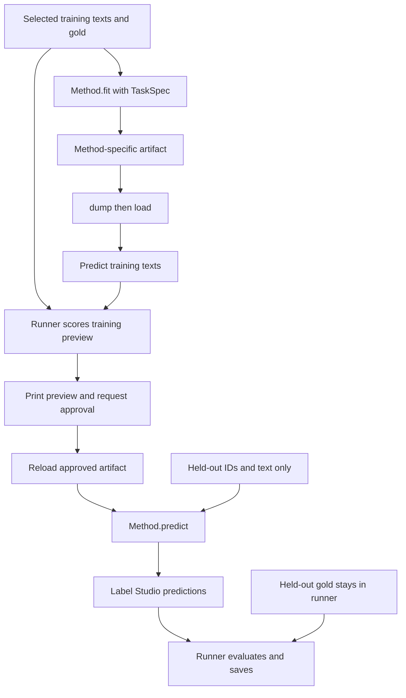

# How the extraction methods work

Each method turns text into the same Label Studio prediction format, but learns
from examples in a different way. These guides explain the current code and the
choices behind it:

| Method | What fitting produces | What predicts entities | Relations | Guide |
| --- | --- | --- | --- | --- |
| `bert` | Trained token-classifier weights and tokenizer | A local Transformer encoder and classifier | Not predicted | [BERT](bert.md) |
| `llm` | A fixed prompt, labeled demonstrations and server settings | Gemma through LM Studio | Predicted when supported by extracted entities | [LLM](llm.md) |
| `dummy` | The task definition | An empty result for every document | Not predicted | [Dummy](dummy.md) |

Start with [installation](../install.md) for dependencies and data, or the
[CLI guide](../cli.md) for commands and flags. The method guides focus on the
algorithms, their artifacts and the rationale of the implementation.

## The shared contract

[methods/base.py](../../methods/base.py) defines `Method[ArtifactT]`, a generic
abstract class with four operations:

```python
artifact = method.fit(train_examples, task_spec, dev_examples=None, scorer=None)
method.dump(artifact, directory)
artifact = method.load(directory)
predictions = method.predict(artifact, inputs)
```

This is the lifecycle; the variables represent already constructed objects.
`ArtifactT` lets each implementation return its own typed state without forcing
weights, prompts and rules into one container. For example, BERT's artifact owns
a model and tokenizer, while LLM's artifact owns a prompt and demonstrations.

The common types live in [data.py](../../data.py):

| Type | Contents | Why it exists |
| --- | --- | --- |
| `DocumentInput` | Document ID and text | Prediction has no annotation field. |
| `TrainingExample` | A `DocumentInput` and selected `GoldAnnotation` | Fitting receives the example and its target together. |
| `TaskSpec` | Entity labels, relation labels, Label Studio control names and optional instructions | Defines the desired extraction vocabulary and output controls. |
| `LabelStudioTaskPrediction` | Document ID/text and one prediction containing entity/relation results | All methods can use the same serializer and evaluator. |

`TaskSpec.instructions` is optional: LLM inserts it into the prompt, while BERT
uses the label vocabulary and does not interpret prose instructions. Dummy keeps
the task definition for reload. A shared field need not affect every algorithm.

Required method-specific settings belong in `BertConfig` or `LLMConfig`.
`dev_examples` and `scorer` are optional keyword arguments shared by all methods;
none of these three implementations currently uses them. A future optimizer can
validate that it needs them inside its own `fit`.

The base class defines method signatures, not an automatic validation pipeline.
The CLI selects gold and validates annotations before fitting. Direct Python
callers should build valid examples too. Method-specific checks, such as BERT's
requirement for nonempty training data, stay in that implementation.

## What gives a method its learning signal?

BERT's learning signal is the target token labels derived from gold spans. Its
model computes a differentiable loss, and Transformers' Trainer updates the
trainable parameters. The evaluator's strict F1 is a separate measurement after
prediction; BERT does not need an F1 callback to train.

LLM fitting places gold extractions next to their texts in the prompt. Gemma uses
those demonstrations during inference. This implementation does not search for
a better prompt or change model weights. Dummy does not learn from the targets.

There is consequently no shared optimizer between evaluator and method. The
common contract describes inputs, reusable fitted state and predictions; each
method owns how it learns. A future prompt optimizer could use the supplied
`scorer` with allowed train/development examples during `fit`.

## What the runner owns

The orchestration currently lives in [cli.py](../../cli.py). It chooses the
training/prediction slices, selects gold (the clinician revision by default),
validates examples, creates the method, and handles approval and result files.



The prediction method receives held-out IDs and text only. Held-out gold goes to
the evaluator after extraction. The CLI also rejects prediction texts that were
used for fitting, including copies with different IDs. Sample selection follows
file order; `--seed` affects BERT training rather than choosing a split.

Approval confirms that the user accepts the saved training preview. It records a
decision in `fit.json`; it does not update weights or prompts. Training-preview
scores reuse fitting examples and are not a held-out estimate.

## Why all outputs use character spans

An entity result stores a label and `[start, end)` character positions: the start
is included, the end excluded, and its text is `document.text[start:end]`. A
relation references entity IDs in that same document. This matches the source
annotations and gives every method a common evaluation boundary.

BERT's BIO tags and LLM's quote/occurrence objects are internal adapters. Neither
becomes the harness's stored prediction format. This keeps the evaluator from
depending on how a particular model represents an entity.

[evaluator.py](../../evaluator.py) uses nervaluate for strict entity micro and
per-label precision, recall and F1. A strict match requires the same label, start
and end. The adapter converts exclusive ends to the library's inclusive ends and
orders available exact matches first so overlap matching does not consume them.
Relations are saved but are not scored yet. Failed LLM documents remain in the
evaluation rather than disappearing from its denominator.

The examples in these guides use the first five documents for fitting and the
next five for prediction. They exercise the lifecycle; use larger, deliberately
chosen splits when studying extraction quality.

## Finding the relevant code

| Concern | Implementation |
| --- | --- |
| Method signatures and optional scorer | [methods/base.py](../../methods/base.py) |
| Data types, gold selection and prediction envelope | [data.py](../../data.py) |
| Construction, approval and stage orchestration | [cli.py](../../cli.py) |
| Shared entity metrics | [evaluator.py](../../evaluator.py) |
| Token training and span decoding | [methods/bert.py](../../methods/bert.py) |
| Prompt construction and quote grounding | [methods/llm.py](../../methods/llm.py) |
| Empty predictor | [methods/dummy.py](../../methods/dummy.py) |
