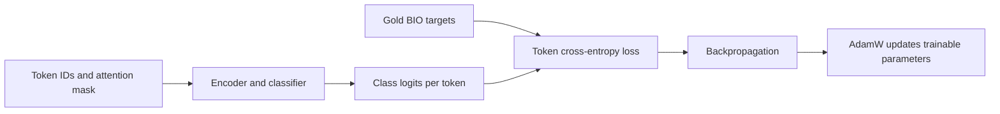

# BERT method: learn token labels, then recover spans

The BERT method is a local supervised entity extractor. It turns annotated
character spans into token labels, trains a classifier, and turns predicted token
labels back into character spans. The default encoder is multilingual DistilBERT.
The implementation is [methods/bert.py](../../methods/bert.py).

See the [shared method contract](README.md) for the runner/evaluator boundary and
[installation](../install.md) for the optional `bert` dependencies.

## Background: encoder, classifier and BIO tags

A BERT encoder produces a contextual vector for each token using the surrounding
text on both sides. A token-classification head maps each vector to one of the
task's labels. This is the general approach described in the
[BERT paper](https://arxiv.org/abs/1810.04805) and Hugging Face's
[token-classification guide](https://huggingface.co/docs/transformers/tasks/token_classification).

DistilBERT is a smaller model obtained by distilling BERT. The
[DistilBERT paper](https://arxiv.org/abs/1910.01108) explains that training approach;
this harness loads an existing checkpoint rather than performing distillation.
The [default checkpoint](https://huggingface.co/distilbert/distilbert-base-multilingual-cased)
is multilingual and preserves case, which makes it a practical starting point
for Spanish text and abbreviations. It still needs a classifier trained for our
annotation labels.

The method uses BIO tags to represent entity boundaries:

| Tag | Meaning |
| --- | --- |
| `O` | Token outside an entity |
| `B-D:AR` | First token of an entity labeled `D:AR` |
| `I-D:AR` | Another token belonging to that entity |

Every entity label gets a `B-` and an `I-` tag. With the supplied XML's 42 entity
labels, this gives `1 + 2 * 42 = 85` classifier classes. The count is computed
from `TaskSpec`; it is not hardcoded to this schema. Relation labels do not become
classifier classes.

BIO assigns one class to a token. Overlapping entities and multiple labels on one
span therefore need a projection into this representation. Evaluation continues
to use the complete original gold.

## Fitting, step by step

### 1. Load the encoder and build the label mapping

`BertMethod.fit` rejects empty training data, sets the CPU thread count and seed,
then creates `O`, `B-...` and `I-...` mappings. It loads the tokenizer and model
through `AutoTokenizer` and `AutoModelForTokenClassification`.

A fast tokenizer is required because its offset mapping connects each token to
characters in the original text. The token-classification head is created or
adapted to the schema's class count; `ignore_mismatched_sizes=True` permits a
checkpoint whose previous head had a different size. This does not mean the new
head already knows the clinical labels.

### 2. Split long texts into overlapping token windows

The tokenizer returns overflow windows with `max_length=256` and `stride=64`.
The length includes special tokens; stride is the number of overlapping tokens
between consecutive windows. It is not a character count or the distance
between window starts.

This lets long documents contribute more than their first window, while giving
some boundary entities another chance to appear inside a complete window. Gold
is aligned separately in every window.

### 3. Project character annotations to token targets

`align_labels` starts real tokens as `O` and marks zero-length special-token
offsets as `-100`. That value tells the loss to ignore a position; the collator
also uses it for padding.

For each gold entity, the function finds tokens whose character ranges intersect
the entity span. The first gets its `B-` class, and subsequent tokens get `I-`.
All intersecting subword pieces receive targets.

The projection makes three deliberate compromises:

| Situation | Current rule | Reason and consequence |
| --- | --- | --- |
| Two entities need the same token | Consider longer spans first, then start and entity ID; skip later conflicts | Gives a deterministic flat BIO target. The omitted entity is recorded in `fit_notes` and remains in evaluation gold. |
| One entity has several labels | Use its first label | A token has one output class. A note records this reduction. |
| Character boundary cuts through a token | Label the intersecting token | The tokenizer cannot express the exact partial-token span; a note records the projection. |

An entity cut off by a window boundary is not trained as a complete entity there.
Its intersecting tokens are ignored where they have not already been assigned
to another entity. This avoids teaching the visible fragment as a negative
example. Overlap helps, but an entity longer than a window cannot fit completely.
Window-edge exclusions do not currently add their own `fit_notes` entry.

### 4. Train with token loss and AdamW

`TokenDataset` is a small wrapper around the prepared window dictionaries.
`DataCollatorForTokenClassification` pads each batch. `Trainer` then runs the
training loop with `optim="adamw_torch"` on CPU.

The learning signal comes from the model's token cross-entropy loss. Passing
`labels` into the default DistilBERT token classifier makes it compute that loss;
Trainer handles backpropagation and the optimizer step. The optimizer updates
parameters using gradients already computed from the loss. It does not call the
harness evaluator to get a learning signal. This division follows Transformers'
[Trainer contract](https://huggingface.co/docs/transformers/main_classes/trainer).



By default, `model.base_model` parameters have `requires_grad=False`. This freezes
the encoder, leaving the classifier head trainable. It reduces the work of the
first CPU experiment. `--full-finetune` also makes encoder weights trainable.

The method does not use `dev_examples` or `scorer`, and the Trainer has no
evaluation dataset or metric callback. It saves no intermediate checkpoints and
reports no external tracking data. Training output uses a temporary directory;
`dump` saves the final artifact. It calls `model.eval()` after training.

## Prediction: tokens back to Label Studio entities

`predict` uses the loaded artifact's configuration, puts the model on CPU in
evaluation mode, and processes each document's overlapping windows. For each
window it:

1. Runs the model under `torch.inference_mode()`.
2. Applies softmax and selects the highest-probability tag at each token.
3. Calls `decode_window` to group tags into candidate spans.

`decode_window` closes an entity at `O` or a special token. A `B-` tag starts a
new entity. An `I-` tag starts one too if its label differs from the active label,
including when no entity is active. This is a permissive repair of invalid BIO
transitions, not a globally constrained sequence decoder.

Each candidate's confidence is the mean probability of its selected token tags.
Candidates from all windows are sorted by descending confidence, then by start,
end and label. A greedy pass keeps a candidate only when it does not overlap any
already retained span. This removes duplicate window predictions and conflicting
spans, but can also discard a valid nested entity. There is no confidence cutoff.

Retained spans are sorted by position and assigned IDs `e0`, `e1`, etc. Their text
is sliced directly from the input using token-derived character positions.
`prediction_for` wraps them in the common Label Studio envelope. This method
does not create relations.

## Configuration and why these defaults exist

| Setting | Default | Purpose | CLI flag |
| --- | --- | --- | --- |
| `checkpoint` | `distilbert/distilbert-base-multilingual-cased` | Existing multilingual encoder | `--checkpoint` |
| `epochs` | 3 | Short first training run | `--epochs` |
| `freeze_encoder` | `True` | Train the classifier head with fewer trainable parameters | `--freeze-encoder` / `--full-finetune` |
| `learning_rate` | `5e-4` | Initial head-training rate | Chosen by CLI; `5e-5` for full fine-tuning |
| `batch_size` | 2 | Small CPU training batches | Python configuration only |
| `max_length` | 256 | Limit per-window computation | Python configuration only |
| `stride` | 64 | Give window boundaries overlapping context | Python configuration only |
| `cpu_threads` | 4 | Limit CPU parallelism | Python configuration only |
| `seed` | 42 | Seed model initialization and training | `--seed` |

The two learning rates are initial baseline choices, not tuned values. In Python,
`BertConfig(freeze_encoder=False)` retains the default `learning_rate=5e-4`
unless you also set it. The lower full-fine-tuning rate is selected by the CLI's
factory, not by `BertConfig` itself.

## What is saved and restored

`BertArtifact` contains the model, fast tokenizer, task definition, configuration
and projection notes. `dump` writes:

```text
artifact/
├── method.json      # Method name, TaskSpec, BertConfig and fit_notes
└── model/           # save_pretrained model files and tokenizer files
    ├── config.json
    ├── model.safetensors
    └── ...
```

`load` reads the manifest and reconstructs both model and tokenizer from
`model/` with `local_files_only=True`. The saved classifier configuration carries
the tag mapping. A fresh process can predict without downloading the original
checkpoint again.

The CLI separately adds `fit.json`, training-preview predictions and training
metrics. Those files handle provenance and approval; they are not model weights.

## Try the fit/reload/predict flow

Choose a new artifact directory and run from the repository root:

```bash
uv run --extra bert python cli.py --stage fit --method bert \
  --data data/grupo1.json --offset 0 --count 5 \
  --dump runs/bert_guide/artifact

uv run --extra bert python cli.py --stage predict \
  --data data/grupo1.json --offset 5 --count 5 \
  --load runs/bert_guide/artifact --output runs/bert_guide/evaluation
```

Review the training preview and answer `y` before prediction. Five examples are
a lifecycle smoke test. A new classifier with 85 classes can have poor strict
F1 on so little data, especially with an unchanged general-purpose encoder.
Token loss can also improve while exact character-span F1 remains poor.

The main limits are flat BIO labels, token-aligned boundaries, greedy window
merging and no relation extraction. Keep the projection notes alongside metrics
when assessing those limits. [tests/test_bert.py](../../tests/test_bert.py) checks
overlap reporting without modifying gold, fitting with a tiny local checkpoint,
saved-weight reload and handling a document longer than one window.
