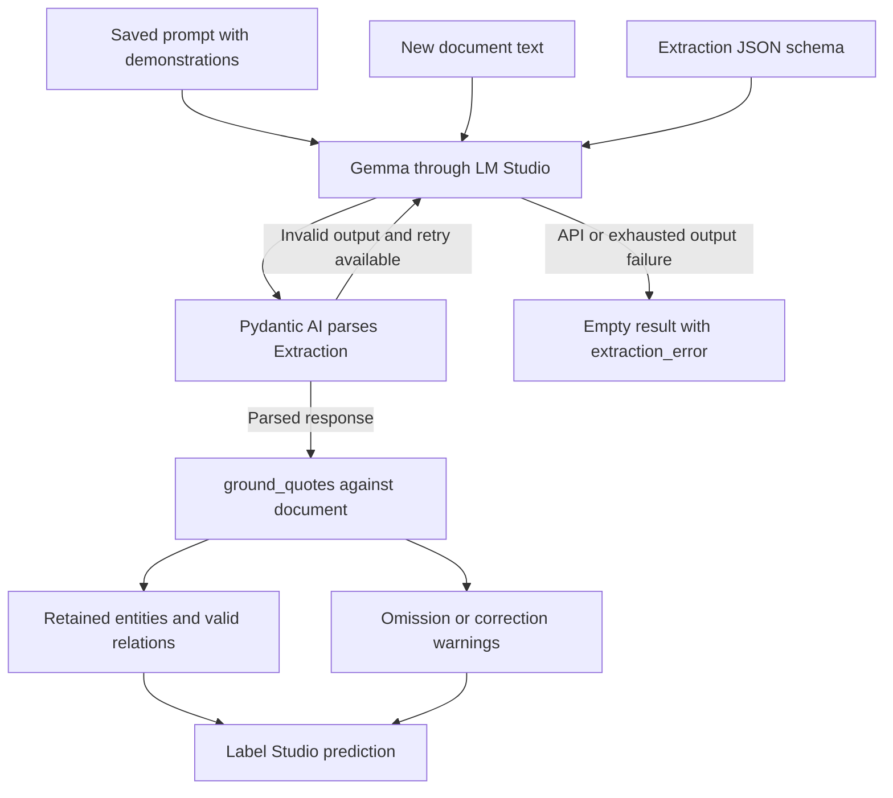

# LLM method: demonstrations, structured output and quote grounding

The LLM method asks Gemma to extract entities and relations using a fixed prompt
with labeled examples. Fitting builds that prompt; prediction calls the local
LM Studio server and converts model responses into Label Studio results.
The implementation is [methods/llm.py](../../methods/llm.py).

See the [shared method contract](README.md) for the evaluator boundary and
[installation](../install.md#5-optional-configure-lm-studio-for-gemma) for server
setup.

## Background: learning from examples in the prompt

A generative language model produces a response token by token from its input
context. This adapter uses that ability to produce extraction JSON.

The model receives instructions, the allowed labels, and examples containing a
text and its expected extraction. When asked to annotate another text, it can
follow those demonstrated patterns. This is few-shot prompting: examples are
part of the inference context rather than a dataset used to update model weights.
The [Language Models are Few-Shot Learners paper](https://arxiv.org/abs/2005.14165)
studies this approach with GPT-3; it is background for the prompting pattern,
rather than an evaluation of Gemma or this dataset.

`fit` therefore means preparing a reusable extraction recipe. It does not call
Gemma, backpropagate, or optimize the prompt against a score. The CLI later calls
`predict` for the training preview, which is why the overall fit stage still needs
the server. The saved artifact contains no Gemma weights; LM Studio must have the
configured model loaded for inference.

The initial model ID is `google/gemma-4-e2b`, with endpoint
`http://localhost:1234/v1`. They are saved settings rather than names embedded in
the method contract. LM Studio exposes an
[OpenAI-compatible API](https://lmstudio.ai/docs/developer/openai-compat), allowing
this adapter to use an OpenAI client pointed at the local server.

## Why use Pydantic AI here?

`Agent` provides a typed request/response boundary. `NativeOutput(Extraction)`
sends the output schema through the model API's structured-output mechanism and
parses the response into Pydantic models. The library also handles an output
validation retry. These features are described in its
[structured-output documentation](https://pydantic.dev/docs/ai/core-concepts/output/).

This keeps schema serialization, parsing and retry handling out of the extraction
code. There are no registered tools or prompt-search loop in this method. The
library is used for a structured extraction call, and the method contract does
not depend on it: another inference adapter could keep the same artifact and
Label Studio outputs.

Structured output validates shape, not meaning. `label` is a string in the
response schema; belonging to the task's vocabulary is checked later. A valid
JSON object can still quote absent text or identify the wrong occurrence.

## The internal response types

| Type | Fields | Role |
| --- | --- | --- |
| `EntityMention` | `id`, `label`, `text`, `occurrence` | Quote an entity and identify which appearance of that quote is intended. |
| `RelationMention` | `from_id`, `to_id`, nonempty `labels` | Link extracted entities by their response IDs. |
| `Extraction` | `entities`, `relations` | Complete response for one document; either list may be empty. |
| `Demonstration` | `text`, `extraction` | One training example converted to the response format. |
| `GroundedResults` | `results`, `warnings` | Label Studio results after deterministic validation against input text. |

`text` must be nonempty and `occurrence` a nonnegative integer. These models are
internal adapters. Saved predictions use character offsets and Label Studio
result dictionaries, just like BERT and dummy.

## Fitting: build the fixed prompt

`demonstration` converts every selected training example into the internal format:

1. It takes each entity quote from `document.text[start:end]`. Gold offsets are
   authoritative, even if an export's stored quote differs from them.
2. It creates fresh IDs such as `e0` and computes the occurrence matching the gold
   start position. Multiple labels become separate mentions.
3. It remaps relation endpoints to those IDs. With multiple labels on one source
   entity, its relations reference the first generated mention.
4. It includes only relations with explicit labels. Unlabeled relations remain in
   the original gold; their types are not guessed for demonstrations.

`LLMMethod.fit` then builds a Spanish prompt containing extraction rules, the
schema's entity/relation vocabularies, optional `TaskSpec.instructions`, and all
selected demonstrations. Each demonstration includes its full text and expected
JSON response. There is no example selection or summarization step inside `fit`.

The rules ask for literal quotes, valid entity IDs and labels, zero-based
occurrences, and empty lists when nothing is found. They explicitly allow
overlapping entities and tell the model not to calculate character offsets.

The prompt must fit a 120,000-character budget. This is a simple early size check,
not a measurement of the server's token context limit. More demonstrations
increase every prediction request's context; the server can reject a request
even when this character check passes.
The check excludes message-format overhead and the output schema. Direct Python
callers can also use `fit([], task_spec)` to build an instruction-only prompt;
the CLI's common fitting flow requires a positive example count.

## Prediction and validation



`_agent` builds a typed agent from the loaded artifact. Its profile declares JSON
schema support, uses the `max_tokens` field, and avoids multiple system messages
for the local adapter. This assumes the chosen server/model supports native
structured output; there is no fallback to a plain-text parser.

`predict` processes documents sequentially. It checks the saved prompt plus
document against the character budget, then calls `agent.run_sync` with a user
message marking the new text as the only document to annotate. It does not pass
evaluation gold. `DocumentInput` is also supplied as typed dependencies, though
the current agent has no tool or validator that consumes those dependencies.

### Recovering offsets from exact quotes

The model supplies a quote and occurrence index because language models can
produce incorrect numeric character positions. Python resolves them using exact,
case-sensitive substring matches. The occurrence count includes appearances
inside words and overlapping substring matches; there is no word-boundary rule.

For text `PCR 12 PCR 5`, this response identifies the second `PCR`:

```json
{
  "entities": [
    {"id": "e0", "label": "T:PCR", "text": "PCR", "occurrence": 1},
    {"id": "e1", "label": "V:VALOR", "text": "5", "occurrence": 0}
  ],
  "relations": [
    {"from_id": "e0", "to_id": "e1", "labels": ["valor"]}
  ]
}
```

The resolved spans are `[7, 10)` for `PCR` and `[11, 12)` for `5`. The relation
keeps the same entity IDs and gets the adapter's fixed `direction="right"`.
This direction field is a serialization choice, not a prediction of text order.

You can exercise grounding without starting LM Studio:

```python
from pathlib import Path

from data import DocumentInput, TaskSpec
from methods.llm import EntityMention, Extraction, ground_quotes

spec = TaskSpec.from_xml(Path("schemas/reumalago.xml"))
document = DocumentInput("quote-demo", "PCR 12 PCR 5")
extraction = Extraction(
    entities=[EntityMention(id="e0", label="T:PCR", text="PCR", occurrence=1)],
    relations=[],
)
grounded = ground_quotes(extraction, document, spec)
print(grounded.results[0]["value"])  # start=7, end=10, text="PCR"
print(grounded.warnings)             # []
```

Run this Python example from the repository root through `uv run python`.

### Grounding keeps valid mentions and reports omissions

`ground_quotes` enforces these rules after the response has parsed:

| Response issue | Action | Rationale |
| --- | --- | --- |
| Quote absent from the input | Omit entity and warn | Do not invent offsets, normalize spelling or expand abbreviations. |
| Invalid occurrence, quote appears exactly once | Correct to occurrence 0 and warn | The input provides one unambiguous span. |
| Invalid occurrence, quote appears several times | Omit entity and warn | There is no basis for choosing one of the repeated spans. |
| Unknown entity label | Omit entity and warn | Output must use `TaskSpec` labels. |
| Duplicate entity ID | Omit every mention with that ID and warn | Relation references would otherwise be ambiguous. |
| Relation endpoint missing or omitted | Omit relation and warn | Only grounded entities can be linked. |
| Unknown relation label | Omit relation and warn | Do not silently change the requested vocabulary. |

Valid entities survive even when another mention is omitted. Overlapping spans
are allowed, and this adapter does not deduplicate identical spans with different
IDs. A valid quote can still have an incorrect label or occurrence; grounding
checks consistency with the input rather than proving semantic correctness.

Warnings are stored in `meta.extraction_warnings` and printed by the CLI, including
before approval. They do not trigger another model call. `to_results` is a stricter
helper used by callers/tests that want any warning to raise; the production
`predict` path calls `ground_quotes` directly.

### Output retries and document failures

The agent allows one repair retry for invalid JSON/output schema. The OpenAI
client has `max_retries=0`, so it does not add automatic HTTP retries. A grounding
warning is a different event: it filters the parsed response without consuming
the output retry budget or asking the model to improve extraction.

Caught API, exhausted-output or value errors produce an empty result with
`meta.extraction_error`. The method continues with the next document. These failed
documents stay in the scores; the CLI saves results and exits unsuccessfully for
an evaluation containing them. Failures in the training preview block approval.
This keeps a failed request distinguishable from a successful empty extraction.

The CLI enables per-document method logs on stderr. It prints full predictions
and scores after the batch. If its preview or approval question is hidden, follow
the [stdout troubleshooting steps](../cli.md#troubleshooting).

## Configuration and why these defaults exist

| Setting | Default | Purpose | CLI flag |
| --- | --- | --- | --- |
| `base_url` | `http://localhost:1234/v1` | Local LM Studio API | `--endpoint` |
| `model` | `google/gemma-4-e2b` | Initial local model | `--model` |
| `thinking` | `False` | Request extraction without reasoning mode | `--thinking` / `--no-thinking` |
| `temperature` | 0.0 | Reduce sampling variability | Python configuration only |
| `max_output_tokens` | 4096 | Bound response length | Python configuration only |
| `max_prompt_characters` | 120,000 | Early prompt-size check | Python configuration only |
| `retries` | 1 | One output-validation repair | Python configuration only |
| `timeout` | 120 seconds | Bound HTTP request waits | Python configuration only |

When thinking is disabled, the adapter sets `openai_reasoning_effort="none"`.
With `--thinking`, it leaves that field unset and uses the server's setting.
Temperature zero is a sampling choice, not a guarantee of identical outputs
across server configurations or versions. A repair adds another request, so the
HTTP timeout is not a total runtime budget for the batch.

The client sends a fixed placeholder API key (`lm-studio`). There is no
configurable authentication flag in this first local adapter.

## What is saved and restored

`LLMArtifact` contains `TaskSpec`, `LLMConfig`, the final prompt string and a tuple
of demonstrations. `dump` writes:

```text
artifact/
├── method.json     # Method name, TaskSpec and LLMConfig
├── prompt.txt      # Complete instructions and demonstrations used for inference
└── examples.json   # Structured demonstrations for inspection and reload
```

`load` reconstructs these objects without contacting the server. Prediction uses
the saved `prompt.txt` directly; it does not rebuild it from `examples.json`.
Keeping the final prompt makes the inference recipe inspectable and avoids
silently rebuilding an old artifact with changed prompt-construction code.
It does not pin LM Studio's model file or server version: those stay external.

The CLI separately adds approval/provenance and training-preview files. Changing
fit-time CLI model flags during `predict` does not override the saved settings.

## Try the complete flow

Start LM Studio, load the model, choose a new artifact directory and run:

```bash
uv run python cli.py --stage run --method llm \
  --data data/grupo1.json --offset 0 --count 5 --predict-count 5 \
  --endpoint http://localhost:1234/v1 --model google/gemma-4-e2b \
  --dump runs/llm_guide/artifact --output runs/llm_guide/evaluation
```

This builds and reloads the prompt, predicts the fitting texts, prints scores and
warnings, and asks for approval. After `y`, it predicts the next five texts.
All demonstrations appear in every inference request, so more examples also cost
more context and inference time.

The current limits include no automatic prompt optimization, a character-based
size check, synchronous per-document calls and reliance on the server's structured
output support. Quote grounding prevents unsupported spans from being fabricated;
it does not guarantee extraction accuracy. Relations are produced but their
metrics remain unimplemented.

[tests/test_llm.py](../../tests/test_llm.py) covers prompt save/reload without a
server, repeated quotes, valid relations, omitted mentions, correction warnings
and preserving failed documents. The warning/approval behavior is also exercised
in [tests/test_cli.py](../../tests/test_cli.py) with fake inference.
